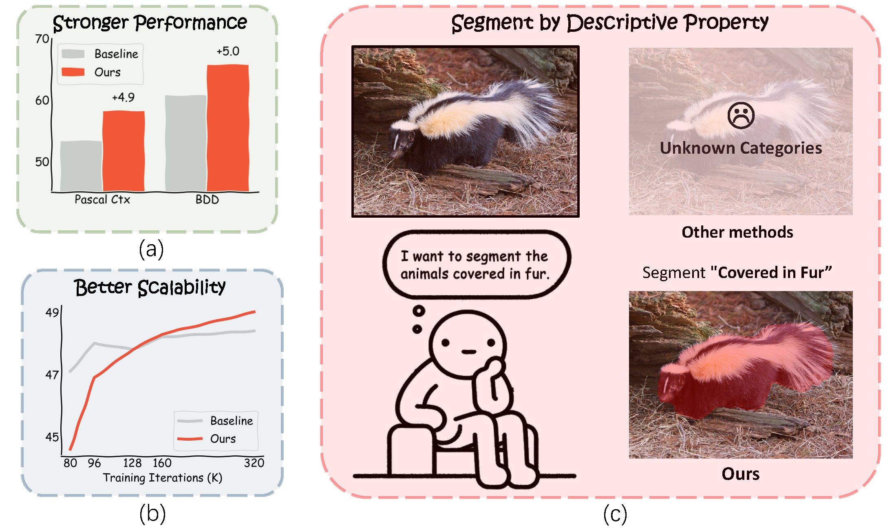

<div align='center'>
  <!-- Paper Title -->
  <h1><strong>ProLab</strong>: <strong>Pro</strong>perty-level <strong>Lab</strong>el Space</h1>
  <h3><a href="https://arxiv.org/abs/2312.13764">A Semantic Space is Worth 256 Language Descriptions: Make Stronger Segmentation Models with Descriptive Properties</a></h3>
  
  <!-- Authors -->
  <p>
    Junfei Xiao<sup>1</sup>, Ziqi Zhou<sup>2</sup>, Wenxuan Li<sup>1</sup>, Shiyi Lan<sup>3</sup>, Zhiding Yu<sup>3</sup>,
    Jieru Mei<sup>1</sup>, Zhiding Yu<sup>3</sup>, <br>Bingchen Zhao<sup>4</sup>, Alan Yuille<sup>1</sup>,
    Yuyin Zhou<sup>2</sup>, Cihang Xie<sup>2</sup>
  </p>
  
  <!-- Institutions -->
  <p>
    <sup>1</sup><a href="https://www.jhu.edu/">Johns Hopkins University</a>, 
    <sup>2</sup><a href="https://www.ucsc.edu/">UCSC</a>, 
    <sup>3</sup><a href="https://www.nvidia.com/">NVIDIA</a>, 
    <sup>4</sup><a href="https://www.ed.ac.uk/">University of Edinburgh</a>
  </p>
  
  <!-- Teaser Image -->
  


</div>


<div align="center">

[Paper](https://arxiv.org/abs/2312.13764) | 
[Property-level Label Space](#property-level-label-space) | 
[Model Zoo](#model-zoo) | 
[Training & Evaluation](#training--evaluation)

</div>


## News

- [12/21] 🔥 **ProLab: Property-level Label Space** is released. We propose to retrieve descriptive properties grounded in common sense knowledge to build a property-level label space which makes strong interpretable segmentation models. Please checkout the [paper](https://arxiv.org/abs/2312.13764).

## Method


## Emerged Generalization Ability


## Contents

- [Getting Started](#getting-started)

- [Data Preparation](#data-preparation) 
  
- [Property-level Label Space](#property-level-label-space)


- [Model Zoo](#model-zoo)

- [Training & Evaluation](#training--evaluation)


## Getting Started

Our segmentation code is developed on top of [MMSegmentation](https://github.com/open-mmlab/mmsegmentation/) and [ViT-Adapter](https://github.com/czczup/ViT-Adapter).

### Setup

We have two tested environments based on **torch 1.9+cuda 11.1+MMSegmentation v0.20.2** and **torch 1.13.1+torch11.7+MMSegmentation v0.27.0**.

**Environment 1** (torch 1.9+cuda 11.1+MMSegmentation v0.20.2)

```
conda create -n prolab python=3.8
conda activate prolab
pip install torch==1.9.0+cu111 torchvision==0.10.0+cu111 torchaudio==0.9.0 -f https://download.pytorch.org/whl/torch_stable.html
pip install mmcv-full==1.4.2 -f https://download.openmmlab.com/mmcv/dist/cu111/torch1.9.0/index.html
pip install timm==0.4.12
pip install mmdet==2.22.0 # for Mask2Former
pip install mmsegmentation==0.20.2
pip install -r requirements.txt
ln -s ../detection/ops ./
cd ops & sh make.sh # compile deformable attention
```

**Environment 2** (torch 1.13.1+cuda 11.7+MMSegmentation v0.27.0)

```
pip install torch==1.13.1+cu117 torchvision==0.14.1+cu117 torchaudio==0.13.1 --extra-index-url https://download.pytorch.org/whl/cu117
pip install mmcv-full==1.7.0 -f https://download.openmmlab.com/mmcv/dist/cu117/torch1.13.0/index.html
pip install timm==0.4.12
pip install mmdet==2.22.0 # may need modification on the limitation of mmcv version 
pip install mmsegmentation==0.27.0
pip install -r requirements.txt
ln -s ../detection/ops ./
cd ops & sh make.sh # compile deformable attention
```

### Data Preparation

#### **ADE20K/Cityscapes/COCO Stuff/Pascal Context**

Please follow the [guidelines](https://github.com/open-mmlab/mmsegmentation/blob/master/docs/en/dataset_prepare.md#prepare-datasets) in MMSegmentation to download **ADE20K, Cityscapes, COCO Stuff and Pascal Context**.

#### BDD

Please visit the [official website](https://bdd-data.berkeley.edu/) to download the **BDD** dataset.

## Property-level Label Space

### Descriptive Properties and Clustered Embeddings (Ready-to-use)

We provide the [retrieved descriptive properties](./descriptors/) (with GPT-3.5) and [property-level labels](https://drive.google.com/drive/folders/1AVpMCi_CoT_JQfuuoVfUS2RLCQHk5fgI?usp=drive_link) (language embeddings) .

### Descriptive Properties Retrieval (Optional)

We also provide [generate_descrtiptions.ipynb](./generate_descrtiptions.ipynb) using GPT 3.5 (API) and LLAMA-2 (local deploy) to retrieve descriptive properties. 

### Encode Descriptions into Embeddings (Optional)

**[generate_embeddings.ipynb](./generate_embeddings.ipynb)** is also provided to encode and cluster the descriptive properties into embeddings with **Sentence Transformer** ([huggingface](https://huggingface.co/sentence-transformers), [paper](https://arxiv.org/abs/1908.10084)) and **BAAI-BGE** models ([huggingface](https://huggingface.co/BAAI/bge-large-en-v1.5), [paper](https://arxiv.org/abs/2309.07597v2)) step-by-step.


## Model Zoo

**ADE20K**

| Method  | Backbone      | Pretrain                                                                                                                   | Lr schd | Crop Size | mIoU | Config | Checkpoint |
| ------- | ------------- | -------------------------------------------------------------------------------------------------------------------------- | ------- | --------- | ---- | ------ | ---------- |
| UperNet | ViT-Adapter-B | [DeiT-B](https://dl.fbaipublicfiles.com/deit/deit_base_patch16_224-b5f2ef4d.pth)                                           | 320k    |  512  | 49.0 | [config](./configs/ADE20K/upernet_deit_adapter_base_512_320k_ade20k_bge_base.py)       |   [Google Drive](https://drive.google.com/file/d/1sCag4rcLno_qSnMPpeD5XdikEBucfkH3/view?usp=sharing)         |
| UperNet | ViT-Adapter-L | [BEiT-L](https://conversationhub.blob.core.windows.net/beit-share-public/beit/beit_large_patch16_224_pt22k_ft22k.pth)      | 160k    |  640  | 58.2 | [config](./configs/ADE20K/upernet_beit_adapter_large_640_160k_ade20k_bge_base.py)       |   [Google Drive](https://drive.google.com/file/d/1zi2g__mZg0Y0GuZCx3gpmVXCnOCqt4Ut/view?usp=sharing)         |
| UperNet | ViT-Adapter-L | [BEiTv2-L](https://conversationhub.blob.core.windows.net/beit-share-public/beitv2/beitv2_large_patch16_224_pt1k_ft21k.pth) | 80K     |  896  | 58.7 | [config](./configs/ADE20K/upernet_beitv2_adapter_large_896_160k_ade20k_bge_base.py)    |  [Google Drive](https://drive.google.com/file/d/1bJXd04eWeVvQT12fQPlLKT_bXQTdSNJN/view?usp=sharings)          |

**COCO-Stuff-164K**

| Method  | Backbone      | Pretrain                                                                         | Lr schd | Crop Size | mIoU | Config | Checkpoint |
| ------- | ------------- | -------------------------------------------------------------------------------- | ------- | --------- | ---- | ------ | ---------- |
| UperNet | ViT-Adapter-B | [DeiT-B](https://dl.fbaipublicfiles.com/deit/deit_base_patch16_224-b5f2ef4d.pth) | 160K    |  512  | 45.4 |   [config](./configs/COCO_Stuff/upernet_deit_adapter_base_512_160k_coco_stuff_bge_base.py)     | [Google Drive](https://drive.google.com/file/d/12sCXqJ0Dsois_ywKYSUiezprwgGq8QkA/view?usp=sharing)           |

**Pascal Context**

| Method  | Backbone      | Pretrain                                                                         | Lr schd | Crop Size | mIoU | Config                                                                                                                                                                             | Checkpoint                                                                                            |
| ------- | ------------- | -------------------------------------------------------------------------------- | ------- | --------- | ---- | ---------------------------------------------------------------------------------------------------------------------------------------------------------------------------------- | ----------------------------------------------------------------------------------------------------- |
| UperNet | ViT-Adapter-B | [DeiT-B](https://dl.fbaipublicfiles.com/deit/deit_base_patch16_224-b5f2ef4d.pth) | 160K    |  512  | 58.2 | [config](./configs/pascal_context/upernet_deit_adapter_base_512_160k_pascal_context_59_bge_base_gpt3.5_cluster_128_cosine_simi_with_sigmoid_cosine_loss_temp_0.04_unnormalized.py) | [Google Drive](https://drive.google.com/file/d/157nrTusisS_KD1M_y-AukHbTr0PXVI5e/view?usp=drive_link) |

**Cityscapes**

| Method  | Backbone      | Pretrain                                                                         | Lr schd | Crop Size | mIoU | Config                                                                                                                                                                 | Checkpoint                                                                                            |
| ------- | ------------- | -------------------------------------------------------------------------------- | ------- | --------- | ---- | ---------------------------------------------------------------------------------------------------------------------------------------------------------------------- | ----------------------------------------------------------------------------------------------------- |
| UperNet | ViT-Adapter-B | [DeiT-B](https://dl.fbaipublicfiles.com/deit/deit_base_patch16_224-b5f2ef4d.pth) | 160K    |  768  | 81.4 | [config](./configs/cityscapes/upernet_deit_adapter_base_768_160k_cityscapes_bge_base_gpt3.5_cluster_32_cosine_simi_with_sigmoid_cosine_loss_temp_0.04_unnormalized.py) | [Google Drive](https://drive.google.com/file/d/1QcoEvGMlpOLaUB4V71c8Qhxx7SpNfRO6/view?usp=drive_link) |

**BDD**

| Method  | Backbone      | Pretrain                                                                         | Lr schd | Crop Size | mIoU | Config                                                                                                                                                           | Checkpoint                                                                                            |
| ------- | ------------- | -------------------------------------------------------------------------------- | ------- | --------- | ---- | ---------------------------------------------------------------------------------------------------------------------------------------------------------------- | ----------------------------------------------------------------------------------------------------- |
| UperNet | ViT-Adapter-B | [DeiT-B](https://dl.fbaipublicfiles.com/deit/deit_base_patch16_224-b5f2ef4d.pth) | 160K    |  768  | 65.7 | [config](./configs/bdd100k/upernet_deit_adapter_base_768_160k_bdd100k_bge_base_gpt3.5_cluster_32_cosine_simi_with_sigmoid_cosine_loss_temp_0.04_unnormalized.py) | [Google Drive](https://drive.google.com/file/d/1ksAPKhCs7pk8TyiP3LkBeq7QZoW_RiC4/view?usp=drive_link) |

## Training & Evaluation


## Citation

If this paper is useful to your work, please cite:
```latex
@article{xiao2023semantic,
  author    = {Xiao, Junfei and Zhou, Ziqi and Li, Wenxuan and Lan, Shiyi and Mei, Jieru and Yu, Zhiding and Yuille, Alan and Zhou, Yuyin and Xie, Cihang},
  title     = {A Semantic Space is Worth 256 Language Descriptions: Make Stronger Segmentation Models with Descriptive Properties},
  journal   = {arXiv preprint arXiv:2312.13764},
  year      = {2023},
}
```

## Acknowledgement

[GPT-3.5](https://arxiv.org/abs/2005.14165v4) and [Llama-2](https://huggingface.co/meta-llama/Llama-2-7b-hf) are used for retrieving descriptive properties.

[Sentence Transformer](https://huggingface.co/sentence-transformers) and [BAAI-BGE](https://huggingface.co/BAAI/bge-large-en-v1.5) are used as description embedding models.

[MMSegmentation](https://github.com/open-mmlab/mmsegmentation/) and [ViT-Adapter](https://github.com/czczup/ViT-Adapter) are used as the segmentation codebase.

Many thanks to all these great projects .
